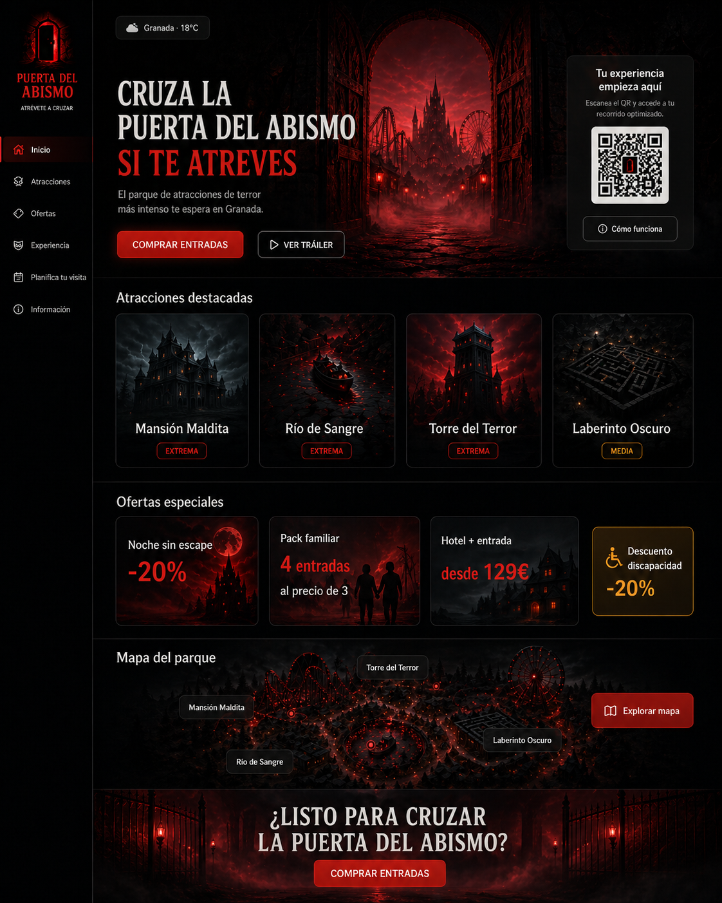
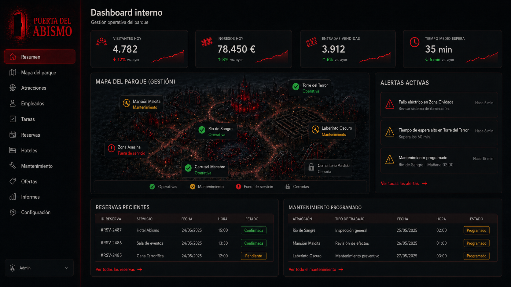
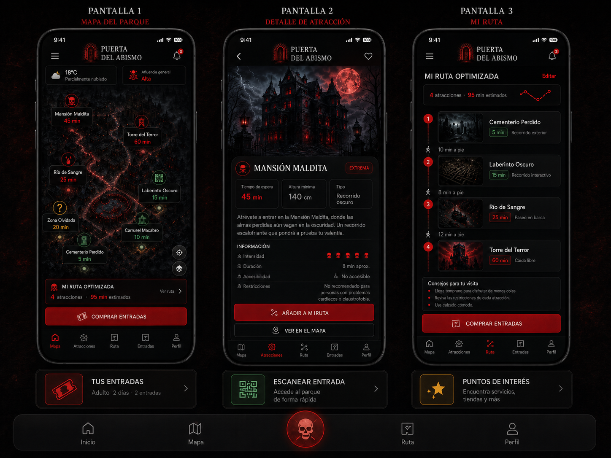

# VISUAL_REFERENCE.md - Referencia visual oficial

## 1. Objetivo

Este documento recoge las referencias visuales oficiales aprobadas por el cliente para orientar el diseño frontend de La Última Puerta.

Las imágenes incluidas sirven como referencia de:

- Composición.
- Jerarquía visual.
- Atmósfera.
- Paleta.
- Estructura general.
- Tono visual.
- Nivel de acabado esperado.

Las imágenes no son contrato funcional. No autorizan por sí solas nuevas funcionalidades, endpoints, DTOs, campos JSON, servicios API, lógica de negocio ni cambios de arquitectura.

## 2. Decisión final del cliente

Decisión aprobada por el cliente:

- Nombre definitivo: La Última Puerta.
- Slogan definitivo: ¿Te atreves a cruzarla?
- Logo: puerta gótica roja.
- Color principal: rojo.
- Home definitiva: diseño 1.
- Dashboard definitivo: diseño 1.
- Mobile definitiva: diseño 3.

## 3. Home pública

La Home pública debe tomar esta imagen como referencia visual oficial.

### Mantener como referencia

- Landing cinematográfica.
- Hero visual potente.
- Composición oscura y roja.
- Estética de terror premium.
- Atracciones destacadas.
- Ofertas visibles.
- Mapa visual del parque.
- CTA de compra.
- Acceso o QR hacia la experiencia mobile cuando aplique.
- Enfoque comercial y visual.

### No inferir automáticamente

- Compra real.
- Pasarela de pago.
- Login.
- KPIs internos.
- Tablas de administración.
- Alertas internas.
- Datos de empleados.
- Métricas operativas.
- Funcionalidades no validadas.

## 4. Dashboard interno

El Dashboard interno debe tomar esta imagen como referencia visual oficial.

### Mantener como referencia

- Sidebar vertical.
- Panel operativo limpio.
- KPIs superiores.
- Mapa operativo.
- Estados de atracciones.
- Alertas activas.
- Reservas recientes.
- Mantenimiento programado.
- Uso de rojo, verde y amarillo para estados.
- Enfoque administrativo.
- Separación clara entre datos internos y contenido comercial.

### No inferir automáticamente

- Datos reales hardcodeados.
- Métricas calculadas en React.
- Endpoints nuevos.
- Servicios API no definidos.
- Funcionalidades backend no documentadas.
- Elementos comerciales propios de la Home pública.
- Flujo mobile del visitante.
- Gráficas externas sin aprobación.
- Librerías externas sin aprobación.

## 5. Mobile Experience

La experiencia mobile debe tomar esta imagen como referencia visual oficial.

### Mantener como referencia

- Diseño mobile-first.
- Mapa del parque.
- Detalle de atracción.
- Mi ruta optimizada.
- Tiempos de espera por atracción.
- Estado de atracciones dentro del recorrido.
- Botón de actualizar ruta.
- Progreso del visitante.
- Uso de LocalStorage para progreso.
- Acceso mediante QR.
- Interfaz simple para visitante dentro del parque.

### No inferir automáticamente

- App nativa.
- Login.
- Pago real.
- Perfil complejo.
- Dashboard interno.
- Gestión administrativa.
- Geolocalización real.
- WebSockets.
- IA.
- Funcionalidades no validadas.

## 6. Reglas de interpretación de las imágenes

Las imágenes deben interpretarse como referencia visual y de composición.

Reglas:

- No todo lo visible en las imágenes implica funcionalidad automática.
- La funcionalidad real debe validarse con la documentación del proyecto.
- No se deben inventar endpoints, campos JSON, DTOs ni servicios API a partir de una imagen.
- No se deben crear rutas nuevas solo porque aparezcan elementos visuales en una maqueta.
- No se deben mezclar Home, Dashboard y Mobile.
- Si una funcionalidad aparece en la imagen pero no está documentada, debe validarse antes de implementarse.
- Si una imagen contradice el contrato API, manda el contrato API.
- Si una imagen contradice el alcance frontend, manda docs/FRONTEND_CONTEXT.md.

## 7. Fuente de verdad funcional

La funcionalidad real se valida siempre con:

- AGENTS.md.
- docs/FRONTEND_CONTEXT.md.
- docs/API_CONTRACT.md.
- docs/CONTRACT_TESTING.md.
- docs/API_NAMING_DICTIONARY.md si existe en la rama actual.

Prioridad documental:

1. AGENTS.md define normas generales y flujo de trabajo.
2. docs/FRONTEND_CONTEXT.md define contexto funcional frontend, separación de experiencias, alcance y decisiones del cliente.
3. docs/API_CONTRACT.md manda sobre endpoints, requests, responses y campos JSON.
4. docs/CONTRACT_TESTING.md manda sobre contract testing.
5. docs/API_NAMING_DICTIONARY.md es una guía rápida de naming y no sustituye al contrato API.
6. docs/VISUAL_REFERENCE.md orienta composición visual y estilo, pero no define contrato funcional.

## 8. Límites de alcance

No implementar sin validación previa:

- Login de visitante.
- Pago real.
- Compra real desde mobile.
- WebSockets.
- IA.
- Geolocalización real.
- State manager global.
- Librerías UI externas.
- Gráficas externas.
- Carruseles externos.
- Iconos externos.
- Funcionalidades visibles en las imágenes pero no documentadas.
- Endpoints no definidos en docs/API_CONTRACT.md.
- Campos JSON no definidos en docs/API_CONTRACT.md.
- Servicios API no alineados con docs/API_CONTRACT.md.

## 9. Uso recomendado para futuros trabajos

Antes de trabajar en una vista visual concreta:

- Para Home pública, revisar la sección Home pública de este documento.
- Para Dashboard interno, revisar la sección Dashboard interno de este documento.
- Para Mobile Experience, revisar la sección Mobile Experience de este documento.

Después, validar siempre el alcance con docs/FRONTEND_CONTEXT.md.

Si el trabajo afecta a comunicación frontend-backend, revisar también docs/API_CONTRACT.md, docs/CONTRACT_TESTING.md y docs/API_NAMING_DICTIONARY.md si existe.
